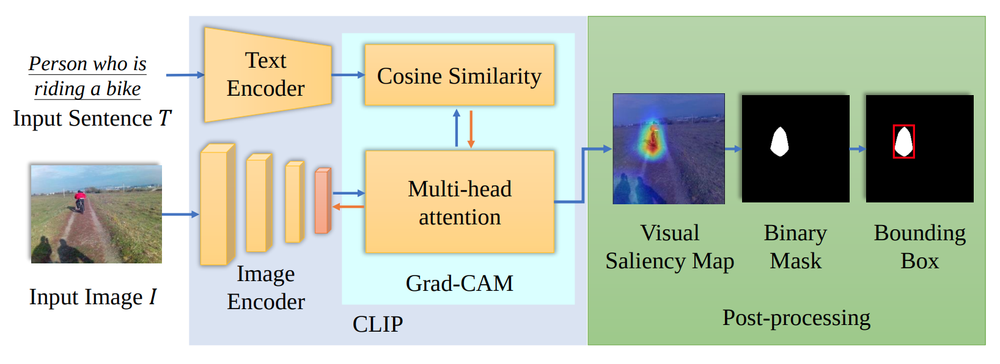
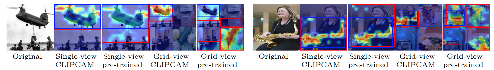
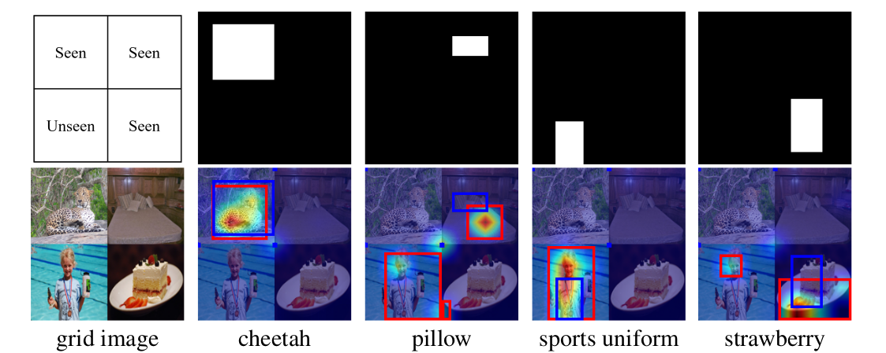
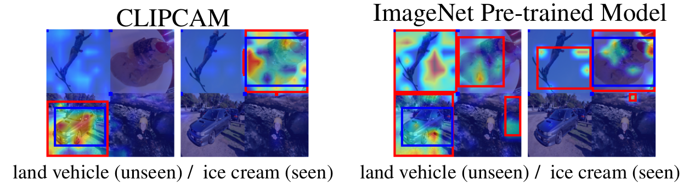
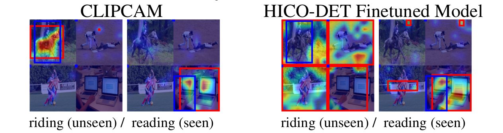
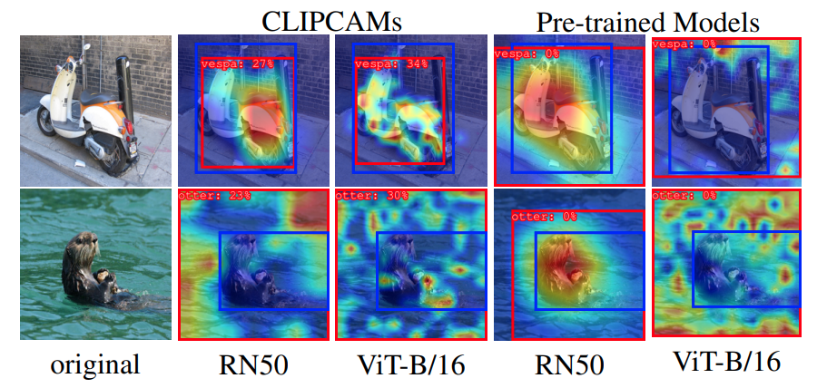
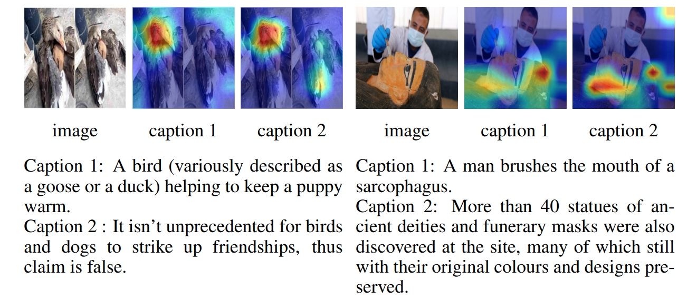
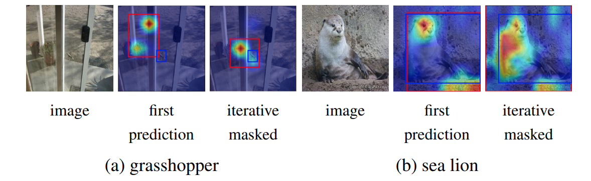
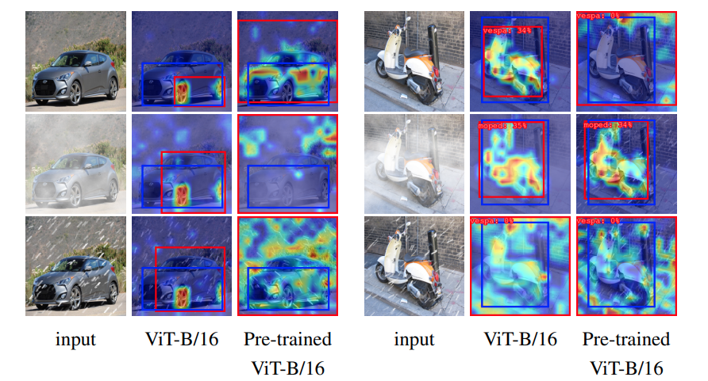

# CLIPCAM: Zero-shot Text-guided Object and Action Localization
## Official implementation of CLIPCAM: A Simple Baseline for Zero-shot Object and Action Localization (ICASSP 2022)



## Table of Contents
* [Environment Setup](#environment-setup)
* [Supported models for CLIPCAM](#supported-models-for-clipcam)
* [CAM Variations](#cam-variations)
* [Dataset Preparation](#dataset-preparation)
* [Evaluation](#evaluation)
    * [Grid-view Zero-shot Object Localization](#grid-view-zero-shot-object-localization)
        * OpenImage
    * [Grid-view Zero-shot Action Localization](#grid-view-zero-shot-action-localization)
        * HICO-DET
    * [Single-image Zero-shot Object Localization](#single-image-zero-shot-object-localization)
        * OpenImage
        * ILSVRC
        * COSMOS
        * Custom Images
* [Other features](#other-features)
    * [Iterative Mask](#iterative-mask)
    * [Weather Attacks](#weather-attack)

## Demo
Please go to this [link](https://jtchen0528.github.io/CLIPCAM/) for a quick demo.

## Environment Setup
1. create conda enviroment with Python=3.7  
`conda create -n clipcam python=3.7`  
`conda activate clipcam`
2. install pytorch 1.9.0, torchvision 0.10.0 with compatible cuda version (or any compatible torch version)  
`pip install torch==1.9.0+cu111 torchvision==0.10.0+cu111 -f https://download.pytorch.org/whl/torch_stable.html`
3. install required package  
`pip install -r requirements.txt`

## Supported Models for CLIPCAM  
### CLIP Models (from [OpenAI](https://github.com/openai/CLIP)):  
example: `--clip_model_name ViT-B/16`
* ViT-B/16
* ViT-B/32
* RN50
* RN101
* RN50x4
* RN50x16

### ImageNet Pre-trained Models
example: `--clip_model_name ViT-B/16-pretrained`
* [ViT-B/16-pretrained](https://rwightman.github.io/pytorch-image-models/models/vision-transformer/)
* [ViT-B/32-pretrained](https://rwightman.github.io/pytorch-image-models/models/vision-transformer/)
* [RN50-pretrained](https://pytorch.org/vision/stable/models.html)
* [RN101-pretrained](https://pytorch.org/vision/stable/models.html)
* [DeiT-pretrained](https://github.com/facebookresearch/deit)

## CAM Variations
### CAMs for CLIP (CLIPCAMs) (from [pytorch-grad-cam](https://github.com/jacobgil/pytorch-grad-cam))
example: `--cam_model_name GradCAM`
* GradCAM
* GradCAMPlusPlus
* XGradCAM
* ScoreCAM
* EigenCAM
* EigenGradCAM
* GuidedBackpropReLUModel
* LayerCAM

### CAMs for other models (from [pytorch-grad-cam](https://github.com/jacobgil/pytorch-grad-cam))
example: `--cam_model_name GradCAM_original`
* GradCAM_original
* GradCAMPlusPlus_original
* XGradCAM_original
* ScoreCAM_original
* EigenGradCAM_original
* EigenCAM_original
* GuidedBackpropReLUModel_original
* LayerCAM_original

## Dataset Preparation
1. OpenImage V6  
Download [OpenImage V6](https://storage.googleapis.com/openimages/web/download.html) validation set with `data_prep/openimage.py`.
2. HICO-DET  
Download HICO-DET from this [link](http://www-personal.umich.edu/~ywchao/hico/).
3. ILSVRC (optional)  
Download [ILSVRC](https://www.image-net.org/download.php) validation set.
4. COSMOS (optional)  
Download [COSMOS](https://github.com/shivangi-aneja/COSMOS) validation set.

## Evaluation


### Grid-view Zero-shot Object Localization




1. Dataset structure (OpenImage)
    ```
    |--OpenImage
        |--validation
            |--data
                |--{image_path_1}
                |--{image_path_2}
                |-- ...
            |--labels
                |--detections.csv
            |--metadata
                |--classes.csv
    ```
2. Run `evaluate_grid_openimage.py` with any model selection
    ```
    python evaluate_grid_openimage.py \
        --data_dir Dataset/OpenImage/validation \
        --gpu_id 0 \
        --clip_model_name 'ViT-B/32' \
        --cam_model_name 'GradCAM' \
        --save_dir 'eval_result/grid/openimage/vitb32-grad' \
        --mask_threshold 0.2 \
        --sentence_prefix 'a photo of ' \
        --attack 'None' \
        --save_result 1
    ```

### Grid-view Zero-shot Action Localization


1. Dataset structure (HICO-DET)
    ```
    |--HICO-DET
        |--images
            |--test
                |--{image_path_1}
                |--{image_path_2}
                |-- ...
            |--train
                |--{image_path_1}
                |--{image_path_2}
                |-- ...
        |--anno.mat
        |--anno_bbox.mat
    ```
2. Run `verb_grid.py` for pre-trained model  
Train the model with half of the classes in HICO-DET.  
Or download the fine-tuned checkpoints from this [OneDrive](https://msseed9-my.sharepoint.com/:f:/g/personal/17-jack_chen_msseed_idv_tw/Ei-WHzRl4sVOhicSVxf3LdcBeZp8XzPEYpj9JxVijzfnFw?e=1jqNZZ).  
`--train_mode` with 'full', 'few' and 'half' specifies the setting when loading the classes in HICO-DET dataset. 

    ```
    python verb_grid.py \
        --data_dir datasets/hico-det \
        --gpu_id 0 \
        --clip_model_name 'ViT-B/32-pretrained' \
        --cam_model_name 'GradCAM_original' \
        --save_dir 'eval_result/grid/hicodet/vitb32-pretrained-grad' \
        --mask_threshold 0.2 \
        --train_mode 'half' \
        --model_name checkpoints/models/vitb32-pretrained-half-1e-6.pth \ 
        --save_result 1
    ```
3. Run `verb_grid.py` for CLIPCAM
    ```
    python verb_grid.py \
        --data_dir dataset/hico-det \
        --gpu_id 0 \
        --clip_model_name 'ViT-B/32' \
        --cam_model_name 'GradCAM' \
        --save_dir 'eval_result/grid/hicodet/vitb32-grad' \
        --mask_threshold 0.2 \
        --save_result 1
    ```

### Single-image Zero-shot Object Localization
1. OpenImage  
    a. Run `evaluate_openimage.py`  
    ```
    python evaluate_openimage.py \
        --data_dir datasets/OpenImage/validation \
        --gpu_id 0 \
        --clip_model_name 'ViT-B/32' \
        --cam_model_name 'GradCAM' \
        --save_dir 'eval_result/single/openimage/vitb32-grad' \
        --save_result 1 \
        --sentence_prefix 'a photo of ' \
        --distill_num 0 \
        --attack 'None'
    ```
2. ILSVRC  
      
    a. Dataset Structure  
    ```
    |--ImageNet
        |--validation
            |--{label_1}\
                |--{image_path_1}
                |--{image_path_2}
                |-- ...
            |--{label_2}
            |-- ...
        |--bbox
            |--val
                |--{image_path_1}.xml
                |--{image_path_1}.xml
                |-- ...
    ```
    b. Run `evaluate_imagenet.py`  
    ```
    python evaluate_imagenet.py \
        --data_dir dataset/ImageNet/validation \
        --gpu_id 0 \
        --clip_model_name 'ViT-B/32' \
        --cam_model_name 'GradCAM' \
        --save_dir 'eval_result/single/imagenet/vitb32-grad' \
        --batch 128 \
        --save_result 1 \
        --sentence_prefix 'sentence' \
        --attack 'None'
    ```
3. COSMOS, OpenImage and custom images  
      
    a. Run `evaluate.py`  with `--dataset cosmos` or `--dataset openimage`
    ```
    python evaluate.py \
        --data_dir datasets/COSMOS/val \
        --gpu_id 0 \
        --dataset cosmos \
        --clip_model_name 'ViT-B/32' \
        --cam_model_name 'GradCAM' \
        --save_dir 'eval_result/single/cosmos/vitb32-grad' \
        --distill_num 0 \
        --attack 'None'
    ```

4. Test on images with custom guiding text
    a. Put the images in a folder and run `evaluate.py`
    b. Run `evaluate.py` without specifying `--dataset`
    ```
    python evaluate.py \
        --data_dir {path to folder} \
        --gpu_id 0 \
        --clip_model_name 'ViT-B/32' \
        --cam_model_name 'GradCAM' \
        --save_dir 'eval_result/custom-input-vitb32-grad'  \
        --distill_num 0
    ```
## Other features
### Iterative Mask
We propose an iterative refinement method based on masking out high neural importance areas to expand attention or enhance weak response regions.  
  
Set `--distill_num {n}` to iteratively mask out {n} times. 

### Weather Attacks
We experimented the ability of CLIPCAM to handle attacked images.  
  
Set `--attack fog` or `--attack snow` to create fog or snow attack. 

## Citing
If you find the paper or the code useful for your study, please consider citing the CLIPCAM paper:
```bash
@article{clipcam_hsia_icassp2022,
    author = {Hsia, Hsuan-An and Lin, Che-Hsien and Kung, Bo-Han and Chen, Jhao-Ting and Tan, Daniel Stanley and Chen, Jun-Cheng and Hua, Kai-Lung},
    title = "{CLIPCAM: A Simple Baseline for Zero-shot Text-guided Object and Action Localization}",
    booktitle = {Proceedings of IEEE International Conference on Acoustics, Speech and Signal Processing (ICASSP)},
    year = {2022}
}
```

## Contact Us
If you have questions regarding the paper or code, please open an issue or email us: [Jhao-Ting Chen](mailto:jtchen0528@outlook.com) or [Che-Hsien Lin](lch19f@gmail.com). We will get back to you as soon as possible.